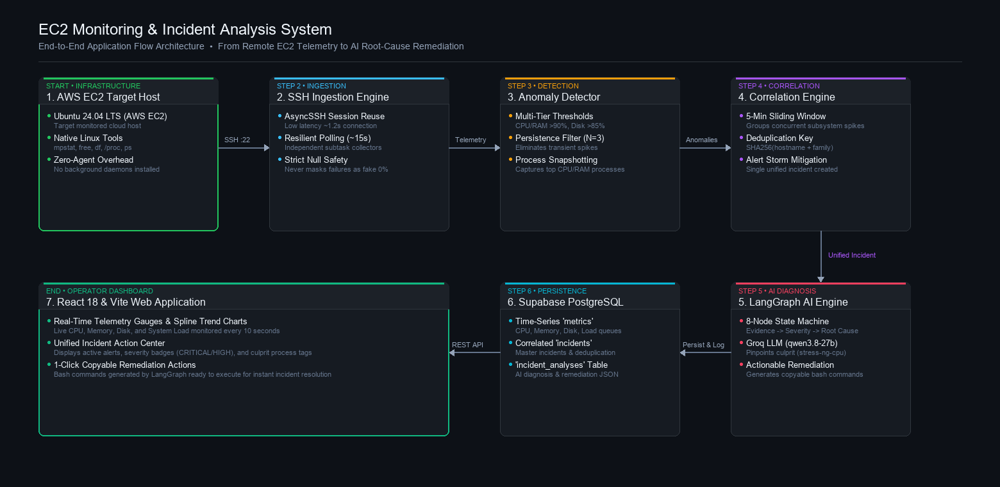

# EC2 Monitoring and Incident Analysis System

Agentless monitoring and automated incident analysis platform for AWS EC2 instances. Collects native Linux performance metrics over SSH, detects anomalies deterministically, correlates multi-resource spikes into unified incidents, and delivers root cause analysis with actionable remediation commands.

---

## 1. System Architecture & Application Flow

### Flow-Based Architecture Diagram


### End-to-End Flow Pipeline (Mermaid)

```mermaid
flowchart TD
    subgraph S1 ["1. Start: Target Cloud Environment"]
        EC2["<b>AWS EC2 Target Instance (Ubuntu 24.04 LTS)</b><br/>• Monitored Host executing native Linux POSIX commands: mpstat, free, df, /proc/loadavg, ps<br/>• Zero-agent architecture: no background daemons or agents installed on the instance"]
    end

    subgraph S2 ["2. Telemetry Ingestion Engine"]
        SSH["<b>FastAPI AsyncSSH Collector</b><br/>• Reuses secure SSH session (:22) every ~15 seconds for minimal connection overhead<br/>• Strict Null Safety: never masks failed command execution as fake 0% normal"]
    end

    subgraph S3 ["3. Deterministic Anomaly Detection"]
        RULES["<b>Multi-Tier Threshold & Anti-Flapping Engine</b><br/>• Evaluates CPU (>90%), Memory (>90%), Disk (>85%), and System Load against Warning & Critical thresholds<br/>• Anti-flapping filter requires N=3 consecutive anomalous samples to eliminate transient micro-spikes"]
    end

    subgraph S4 ["4. Incident Correlation & Deduplication"]
        CORR["<b>5-Minute Sliding Window Correlation</b><br/>• Groups concurrent multi-resource anomalies on the host into a single unified incident<br/>• Deduplication key: SHA256(hostname + family) prevents duplicate alert storms"]
    end

    subgraph S5 ["5. AI Root Cause Analysis & Remediation"]
        AI["<b>8-Node LangGraph AI State Machine</b><br/>• Powered by Groq LLM (qwen/qwen3.8-27b) with 100% deterministic rule-based fallback<br/>• Pinpoints culprit process (e.g. stress-ng-cpu) and formulates copyable bash remediation commands"]
    end

    subgraph S6 ["6. Persistent Storage"]
        DB[("<b>Supabase PostgreSQL Database</b><br/>• Relational tables: metrics, process_snapshots, anomalies, incident_anomalies<br/>• Master incidents and incident_analyses records for auditability and history")]
    end

    subgraph S7 ["7. End: Operator Action Center"]
        UI["<b>React 18 & Vite Web Application</b><br/>• Real-time system health gauges and historical spline trend charts<br/>• Unified incident cards with culprit process badges and 1-click copyable remediation actions"]
    end

    S1 -->|"1. Polled over AsyncSSH (:22)"| S2
    S2 -->|"2. Raw Telemetry & Process Snapshots"| S3
    S3 -->|"3. Verified Persistent Anomalies"| S4
    S4 -->|"4. Unified Multi-Resource Incident"| S5
    S5 -->|"5. Root Cause Diagnosis & Remediation Plan"| S6
    S4 -.->|"Time-series Metrics Persistence"| S6
    S6 -->|"6. Real-time REST API (/api/v1/...)"| S7
```



---

## 2. Quickstart & Execution Instructions

### Prerequisites
- **Python 3.11+**
- **Node.js 18+** & npm
- **AWS EC2 Linux Instance** (Ubuntu/Debian) with SSH access (`.pem` key)

### One-Command Launch
Start both the Backend API (Port 8000) and Frontend Dashboard (Port 5173):

```bash
# Windows
.\start.bat all

# Linux / macOS / Git Bash
./start.sh all
```

* **Frontend Dashboard**: [http://localhost:5173](http://localhost:5173)
* **Interactive API Documentation (Swagger)**: [http://localhost:8000/docs](http://localhost:8000/docs)

*(Optional) Manual execution:*
- **Backend**: `cd backend && pip install -r requirements.txt && uvicorn app.main:app --reload`
- **Frontend**: `cd frontend && npm install && npm run dev`

---

## 3. Remote Stress Testing Suite

Trigger realistic incident scenarios directly on the remote AWS EC2 instance over SSH to test detection, correlation, and AI analysis:

```bash
# Windows
.\stress.bat

# Linux / Git Bash
./stress_ec2.sh
```

| Option | Scenario | Target Impact | Pipeline Behavior |
|:---:|---|---|---|
| **`[1]`** | **CPU Saturation** | Pins 2 cores at ~97% | Flags `CPU_CRITICAL (>90%)` |
| **`[2]`** | **RAM Saturation** | Allocates 95% available memory | Flags `MEMORY_CRITICAL (>90%)` |
| **`[3]`** | **Root Disk Saturation** | Allocates 13.3 GB in `/var/tmp` on `/dev/root` | Flags `DISK_CRITICAL (>90%)` |
| **`[4]`** | **Assessment Multi-Resource** | Concurrent CPU 96% + RAM 94% | Unified into 1 Incident + LangGraph AI |
| **`[5]`** | **Triple Saturation** | CPU + RAM + Root Disk simultaneously | All 3 resources saturated concurrently |
| **`[6]`** | **Clean & Stop** | Kills `stress-ng` & deletes temporary files | Restores healthy baseline (`0 Active Incidents`) |

---

## 4. Linux Commands & AWS EC2 Configuration

### AWS EC2 Target Host
- **Instance Type**: AWS EC2 `t2.micro` / `t3.micro` (Ubuntu 24.04 LTS, 2 vCPUs, 1 GB RAM, 19 GB EBS root).
- **Agentless Architecture**: No background daemons (Datadog, Prometheus node_exporter) are installed on the target instance. All telemetry is polled remotely via AsyncSSH.

### Native Linux Tools Used for Telemetry:
* **CPU Utilization**: `mpstat 1 1` (instantaneous user/system/idle percentage) and `nproc` (CPU core count).
* **Memory Utilization**: `free -m` (used, free, and available RAM; excludes reclaimable page cache).
* **Disk Usage**: `df -P /` (root partition `/dev/root` capacity and free space).
* **System Load**: `cat /proc/loadavg` (1-min, 5-min, and 15-min runnable process queues).
* **Running Processes**: `ps -eo pid,comm,%cpu,%mem --sort=-%cpu | head -n 10` (culprit process snapshots).
* **Network Statistics**: `cat /proc/net/dev` (bytes received `rx` and transmitted `tx`).
* **System Logs**: `journalctl -p warning..err -n 20 --no-pager` (kernel warnings and systemd errors).

---

## 5. Explanation of Approach: Anomaly Detection

1. **Agentless & Non-Intrusive**:
   - The backend runs a periodic polling loop every 15 seconds over a reused AsyncSSH connection, minimizing network overhead and keeping production EC2 compute clean.

2. **Strict Null Safety (Zero Data Fabrication)**:
   - In cloud operations, an uncollected or failed metric is fundamentally different from a healthy metric (`0%`).
   - If an SSH command fails or times out, the value is stored as `null` (`"-"` in the UI). The anomaly detector skips `null` values without assuming normalcy.

3. **Multi-Tier Thresholds**:
   - **CPU Usage**: Warning `>70%`, Critical `>90%`.
   - **Memory Usage**: Warning `>75%`, Critical `>90%` (reclaimable cache is correctly excluded from usage).
   - **Disk Storage**: Warning `>80%`, Critical `>85%` (EBS root volume).
   - **System Load**: Warning `> Cores × 1.5`, Critical `> Cores × 2.0` (dynamically scaled to core count).

4. **Anti-Flapping Filter (Persistence Tracking)**:
   - Requires $N=3$ consecutive anomalous collection cycles (~45–60 seconds) before raising an alert (`is_persistent = True`), preventing transient micro-spikes from triggering false alarms.

---

## 6. Explanation of Approach: Incident Analysis

1. **Mitigating Alert Storming**:
   - During systemic outages, multiple metrics (CPU, RAM, Load, Disk) surge simultaneously. Instead of generating separate alerts for each metric, the **Correlation Engine** groups all anomalies on that host into a **single unified incident**.

2. **5-Minute Sliding Correlation Window**:
   - When an anomaly occurs, the engine checks for active incidents on the host within a 5-minute sliding window:
     $$\Delta t = \frac{|\text{timestamp} - \text{incident.last\_seen\_at}|}{60 \text{ seconds}} \le 5.0\text{ minutes}$$
   - If $\Delta t \le 5.0$ minutes, the system **does not create a duplicate incident**. It updates the existing incident, extends `last_seen_at`, merges affected metrics, upgrades severity if conditions worsened, and increments `observation_count`.

3. **Deterministic Deduplication Key**:
   - Computes a hash key from `hostname + incident_family` (e.g. `ip-172-31-3-102::resource_saturation`), ensuring repeat occurrences update the existing active incident rather than creating duplicate tickets.

4. **Multi-Metric Correlation Score**:
   $$\text{Score} = \text{CPU}(2.5) + \text{Mem}(2.5) + \text{Load}(2.0) + \text{Disk}(1.5) + \text{Persistence}(+1.0)$$
   - Quantifies the blast radius. If $\text{Score} \ge 5.0$, severity is automatically escalated to `CRITICAL`.

5. **8-Node LangGraph AI Reasoning Workflow**:
   - Passes validated telemetry, process snapshots (`ps`), and journal logs through an 8-node state machine:
     ```
     Context ➔ Evidence ➔ Correlation ➔ Severity ➔ Root Cause ➔ Recommendations ➔ Summary ➔ Validation
     ```
   - **Groq LLM (`qwen/qwen3.8-27b`)**: Identifies causal links between metrics and pinpoints the culprit process (e.g. `stress-ng-cpu` consuming 94.3% CPU).
   - **100% Deterministic Fallback**: If Groq API is unconfigured or rate-limited, built-in deterministic rules generate complete incident analysis without crashing.

6. **Generated Incident Analysis (Task Deliverable)**:
   - **Severity**: `CRITICAL`, `HIGH`, `MEDIUM`, or `LOW`.
   - **Affected Metrics**: e.g., `["cpu_usage", "load_1m", "memory_usage"]`.
   - **Probable Cause**: Exact process identification and resource starvation rationale.
   - **Recommended Action**: Copyable bash commands (e.g., `pkill -9 stress-ng`, `free -m`).

---

## 7. Assessment Scenario Walkthrough (10:00 AM ➔ 10:05 AM)

Demonstrating the exact scenario required by the assessment specification:

* **At 10:00 AM**:
  * **Observed Metrics**: CPU: 92%, Memory: 88%, Disk: 85%, System Load: High (3.2).
  * **System Action**: Anomaly detector flags violations across CPU, Memory, Disk, and Load. The Correlation Engine groups all 4 metrics into **Incident #1** (`CRITICAL: EC2 Resource Saturation`).
* **At 10:05 AM (5 Minutes Later)**:
  * **Observed Metrics**: CPU: 96%, Memory: 91%, System Load: Very High (4.5).
  * **System Action**: The 5-minute sliding window check detects an active incident within $\Delta t \le 5.0$ minutes.
  * **Outcome**: **Zero duplicate alerts are created**. The engine updates Incident #1 with refreshed timestamps, records the continuing cascade, updates the correlation score, and generates an updated LangGraph AI diagnosis with culprit process identification and remediation commands.

---

## 8. Automated Testing

Run the full test suite (49 passing tests):
```bash
cd backend
pytest app/tests/ -v
```
